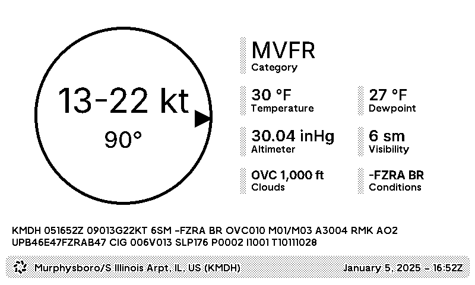

# METAR Plugin for TRMNL

This [TRMNL](https://usetrmnl.com/) plugin displays the current weather conditions for a single METAR station.

This plugin is available as [a recipe](https://usetrmnl.com/recipes/21542/install) for inclusion in your own playlists.

Data is provided by NOAA's [Aviation Weather Center](https://aviationweather.gov/data/api/).

## Local Development

Either the `trmnl_preview` gem or Docker must be installed.

Simply clone the repo, then run `bin/dev`.